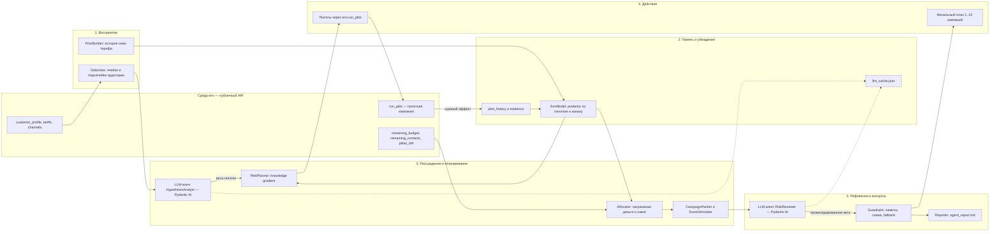
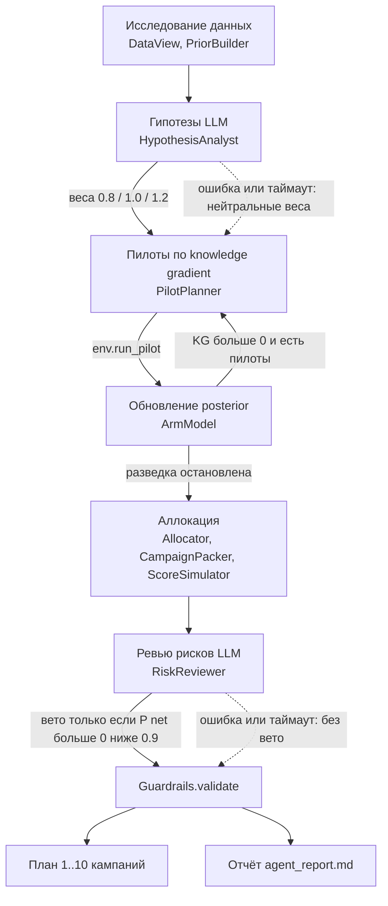
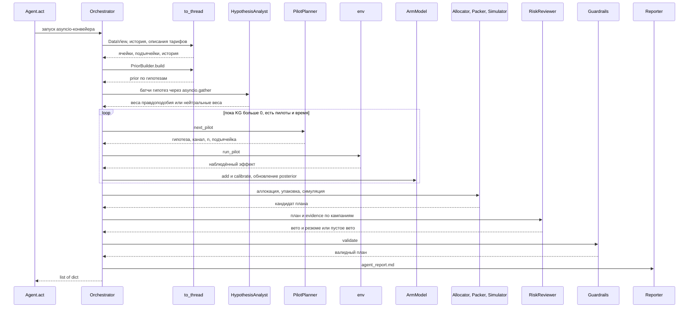

# Агент тарифных маркетинговых кампаний — Beeline × HackAlem AI

Агент для задачи «Beeline Tariff Marketing Campaigns». Он сам исследует базу абонентов, проверяет гипотезы
пилотами и возвращает план из 10 или меньше кампаний (сегмент → целевой тариф → канал), который укладывается
в бюджет и охват. Решения принимает байесовское ядро. LLM-агенты на Pydantic AI (`HypothesisAnalyst`,
`RiskReviewer`) подключаются опционально: ранжируют гипотезы и проверяют риск плана. При любом сбое LLM
агент продолжает работу на детерминированном движке.

> Все данные кейса синтетические. Суммы указаны в условных единицах (у.е.).

Финальная проверка и решения перед сдачей: [release_review.md](reports/release_review.md).
Добавлены численная проверка LLM-вето и `tools/preflight.py`; варианты настройки аллокатора
не включены из-за регрессий на новых seed. Полный набор: **381 тест прошёл**.

## Краткое резюме

| | |
|---|---|
| **Проблема** | Кампания «вслепую» уходит в минус: около половины исторических смен тарифа заканчиваются downsell, а контакт стоит денег. История описывает *другую* выборку, поэтому истинный эффект можно узнать только из шумных пилотов, которые тоже расходуют бюджет. |
| **Решение** | Агентный цикл `исследование → гипотезы (LLM) → пилоты по knowledge gradient → обновление posterior → аллокация (лагранжиан по деньгам и охвату) → ревью рисков (LLM) → guardrails → план + отчёт`. У каждого эффекта есть апостериорное среднее и дисперсия с шумом `0.804/√n`. План проверяется копией правил скоринга. |
| **Результат** | `python local_eval.py` (seed 42): **PASS**, чистый результат **4 814 532** (+3,196% к baseline 150 641 084), ROI 49,15, риск 0,0%. `--runs 10`: медиана **4 418 069**, в плюс **10 из 10**. Результаты стресс-тестов зависят от сценария и seed; см. финальную проверку выше. |

## Быстрый старт

Нужен Python 3.13 (зафиксирован в `.python-version`); чистая установка проверена также на Python 3.12.

```bash
python -m venv .venv && source .venv/bin/activate
pip install -r requirements.txt
pip install pytest                    # только для тестов

python tools/build_agent.py           # собрать agent.py после изменений исходников
python local_eval.py                  # прогон seed 42 скриптом организаторов
python local_eval.py --runs 10        # устойчивость на 10 seed
python make_submission.py             # генерирует submission.csv
pytest                                # модульные и интеграционные тесты
```

LLM подключать не обязательно: по умолчанию `AGENT_LLM_MODE=off`, и сабмит не зависит от ключа.
Для запуска с LLM создайте `.env` (он в `.gitignore`):

```bash
# .env — необязательно
OPENAI_API_KEY=sk-...
AGENT_LLM_MODE=decide                 # off | advise | decide
```

**Для жюри: запуск с LLM.** Одного `OPENAI_API_KEY` недостаточно: пока `AGENT_LLM_MODE` не задан, агент
работает без LLM, и `make_submission.py` побайтно воспроизводит `submission.csv` из репозитория. Чтобы
включить LLM-агентов в контур решений, задайте обе переменные окружения:

```bash
export OPENAI_API_KEY=sk-...
export AGENT_LLM_MODE=decide          # или advise
python make_submission.py
```

С живым LLM ответы модели могут изменить выбор пилотов, и тогда `submission.csv` будет отличаться от
закоммиченного. Вызовы LLM ограничены по времени (30 с на вызов, 90 с суммарно), а при ошибке API агент
продолжает работу на детерминированном движке.

| Команда | Что проверяет | Ожидаемый результат |
|---|---|---|
| `python local_eval.py` | прогон seed 42, отчёт организаторов | Статус PASS, чистый результат 4 814 532 |
| `python local_eval.py --runs 10` | устойчивость на 10 seed | медиана 4 418 069, в плюс 10 из 10 |
| `python make_submission.py` | генерирует `submission.csv` | 9 кампаний, побайтно воспроизводится |
| `python tools/preflight.py --check` | сборка `agent.py` и повторный прогон без перезаписи `submission.csv` | совпадение с существующим файлом |
| `pytest` | модульные и интеграционные тесты | 381 тест проходит |
| `python tools/stress_eval.py --worlds all --runs 3` | 9 сдвинутых миров и оракул | таблица «медиана / оракул» |

Прогон `local_eval.py` занимает около 1,5 с (LLM выключен). Лимит задачи — 10 минут.

## Результаты

Все числа получены неизменёнными скриптами организаторов (`local_eval.py`, `make_submission.py`, `scoring_core.py`)
на мок-эффектах. На судействе эффекты другие, поэтому главный критерий — устойчивость на сдвинутых мирах.

**`python local_eval.py` (seed 42):**

| Метрика | Значение |
|---|---|
| Статус | PASS |
| Чистый результат | **4 814 532** (+3,196% к baseline 150 641 084) |
| Gross | 4 914 516 |
| Затраты | 99 984 из 100 000 |
| Контактов | 14 960 из 15 000 |
| Уникальных абонентов | 10 840 |
| Пилотов | 18 из 20 |
| Финальных кампаний | 9 |
| ROI | 49,15 |
| Риск (доля абонентов с отрицательным эффектом) | 0,0% |
| Время прогона | ≈1,5 с (LLM выключен) |

**`python local_eval.py --runs 10`:** медиана 4 418 069; минимум 3 670 926; максимум 5 122 772; в плюс 10 из 10.

**`make_submission.py`:** `submission.csv` побайтно воспроизводится в двух запусках — с ключом `OPENAI_API_KEY`
и без него. В плане 9 кампаний, каналы: push ×5, sms ×3, digital_ads ×1.

**Стресс-миры** (`python tools/stress_eval.py --worlds all --runs 3`). Оракул (`tools/oracle_eval.py`) знает истинную
модель эффектов мира и упаковывает решение при тех же лимитах — это эвристическая верхняя оценка.

| Мир | Что меняется относительно мока | Медиана агента | Оракул |
|---|---|---|---|
| `mock` | исходные эффекты | 4,70M | 5,66M |
| `scale_x2` | все эффекты ×2 | 9,76M | 10,90M |
| `scale_x0.5` | все эффекты ×0,5 | 2,09M | 2,79M |
| `high_plus_0.15` | +0,15 к изменению ARPU у HIGH-гипотез | 5,46M | 6,47M |
| `permute_targets` | целевые тарифы переставлены внутри ячейки, история вводит в заблуждение | 0,55M | 5,21M |
| `saturation` | конверсия ×3 со срезкой на 1, перенос между каналами нелинеен | 11,81M | 17,34M |
| `flip_sign_30` | знак эффекта перевёрнут у 30% гипотез | 1,43M | 5,07M |
| `prior_misspecified` | эффекты перемешаны независимо от истории | 11,64M | 19,76M |
| `price_decorrelated` | эффект не связан с ценой тарифа | 4,24M | 5,80M |

В этой серии (seed 0–2) все прогоны положительные. На свежих seed 100–104 базовая стратегия дала 43/45
положительных результатов; два убытка возникли в `flip_sign_30`. Средняя доля от оракула в таблице выше — около 0,63.
Самые большие разрывы возникают, когда история систематически врёт (`permute_targets`, `flip_sign_30`):
18–20 пилотов не хватает, чтобы найти все выгодные цели. `tools/loss_breakdown.py` раскладывает разрыв
до оракула по категориям.

## Агентная архитектура

Агент — асинхронный конвейер (`Orchestrator`) с явным циклом «гипотеза → эксперимент → обновление убеждений
→ решение». Среда (`env`) — единственный источник новых фактов; LLM влияет только через провалидированные
структурированные ответы.

### Схема AI-агентной архитектуры

Агент построен по классической схеме «восприятие → память → рассуждение → действие → рефлексия».
Байесовское ядро отвечает за числа, LLM-агенты — за гипотезы и критику, guardrails — за соблюдение лимитов.



**Роли LLM-агентов.** Оба агента реализованы на Pydantic AI: структурированный вывод (pydantic-модели),
read-only инструменты над движком, `output_validator` + `ModelRetry`, `UsageLimits` и таймауты. LLM никогда
не задаёт числа плана напрямую — он влияет только через ограниченные решения (веса 0,8/1,0/1,2 и вето
кампаний), которые затем проверяют симулятор и guardrails. Поэтому ошибка модели не может нарушить лимиты.

### Цикл агента



### Один запуск `Agent.act`



CPU-стадии идут в `asyncio.to_thread`, пилоты — строго последовательно. Каждая стадия ловит свои исключения;
при сбое конвейер переходит к аллокации с тем, что уже известно, а при сбое всего конвейера `Agent.act`
возвращает валидный запасной план из guardrails.

### Компоненты

| Модуль | Файл | Роль |
|---|---|---|
| `Config`, `resolve_llm_mode` | [`agent_src/contract.py`](agent_src/contract.py) | лимиты, риск-параметры, типы, выбор режима LLM |
| `DataView` | [`agent_src/m10_dataview.py`](agent_src/m10_dataview.py) | ячейки и подъячейки, цены тарифов, каналы из `env` |
| `PriorBuilder` | [`agent_src/m20_prior.py`](agent_src/m20_prior.py) | иерархический prior по истории смен тарифа |
| `ArmModel` | [`agent_src/m30_arm_model.py`](agent_src/m30_arm_model.py) | гауссов posterior по гипотезе и каналу, перенос между каналами |
| `ScoreSimulator` | [`agent_src/m40_simulator.py`](agent_src/m40_simulator.py) | векторная копия правил скоринга |
| `Allocator` | [`agent_src/m50_allocator.py`](agent_src/m50_allocator.py) | лагранжиан по деньгам и охвату |
| `CampaignPacker` | [`agent_src/m60_packer.py`](agent_src/m60_packer.py) | упаковка в ≤ 10 кампаний, пересимуляция |
| `PilotPlanner` | [`agent_src/m70_planner.py`](agent_src/m70_planner.py) | выбор пилота по knowledge gradient и правило остановки |
| `LLMLayer` | [`agent_src/m80_llm.py`](agent_src/m80_llm.py) | `HypothesisAnalyst`, `RiskReviewer`, валидация, кэш, fallback |
| `Guardrails`, `Reporter` | [`agent_src/m85_guardrails.py`](agent_src/m85_guardrails.py) | санитизация, лимиты, запасной план, отчёт |
| `Orchestrator`, `Agent` | [`agent_src/m90_orchestrator.py`](agent_src/m90_orchestrator.py) | asyncio-конвейер, дедлайны, verification pilots |

## Реализованные методы

Ниже — какие методы реализованы, зачем каждый нужен и где он находится в коде.

| № | Метод | Зачем | Где в коде |
|---|---|---|---|
| 1 | Иерархическая байесовская усадка (shrinkage) | Устойчивая стартовая оценка эффекта при малом числе наблюдений в истории | `agent_src/m20_prior.py` |
| 2 | Beta-неопределённость доли перехода | Учесть, что конверсия в истории оценена неточно | `agent_src/m20_prior.py` |
| 3 | Гауссов posterior с шумом `0.804/√n` | Учёт надёжности пилота: 150 клиентов точнее 30 | `agent_src/m30_arm_model.py` |
| 4 | Empirical Bayes калибровка prior (β, τ) | Автоматически понять, насколько история «врёт» для целевой аудитории | `ArmModel.calibrate` |
| 5 | Перенос между каналами с защитой от насыщения | Пилот в одном канале информирует решение в другом с учётом `min(conv·mult, 1)` | `agent_src/m30_arm_model.py` |
| 6 | Knowledge gradient + квадратура Гаусса–Эрмита | Выбрать пилот с максимальной ценностью информации за вычетом стоимости | `agent_src/m70_planner.py` |
| 7 | Verification pilots | Проверить гипотезы, которые план собирается развернуть, до крупных затрат | `agent_src/m90_orchestrator.py` |
| 8 | Лагранжева релаксация по двум ресурсам | Оптимально поделить деньги и охват между сегментами | `agent_src/m50_allocator.py` |
| 9 | Нижняя доверительная граница (LCB) и `P(net > 0)` | Защита от winner's curse: не вкладываться в случайно удачный пилот | `agent_src/m50_allocator.py` |
| 10 | Точный симулятор скоринга | Проверять каждый план по тем же правилам, что и при оценке | `agent_src/m40_simulator.py` |
| 11 | Упаковка в ≤ 10 кампаний | Уложить план подъячеек в лимит кампаний с минимальной потерей | `agent_src/m60_packer.py` |
| 12 | LLM-агенты на Pydantic AI | Ранжирование гипотез и ревью рисков со структурированным выводом | `agent_src/m80_llm.py` |
| 13 | Guardrails и fallback | Гарантия валидного плана при любом сбое | `agent_src/m85_guardrails.py` |

### 1–2. Prior из истории (`PriorBuilder`)

По `data/change_tariff.csv` для каждой гипотезы «текущий тариф × ARPU-сегмент → целевой тариф» считаются среднее
относительное изменение ARPU `m` и доля перехода `share`. Точечная оценка эффекта: `e = m · share`.
Гипотез много, а наблюдений у многих мало, поэтому оценка **сжимается** к среднему по ячейке, а ячейка — к
глобальному среднему (иерархическая усадка). Неопределённость доли перехода задаётся распределением
`Beta(c + 1, tot − c + 1)`. Итоговая дисперсия prior: `σ0² = var(m)·share² + m²·var(share) + τ²`.
История описывает *другую* выборку, поэтому prior только ранжирует кандидатов и задаёт стартовую точку, а
решения принимаются по пилотам.

### 3–5. Обновление убеждений по пилотам (`ArmModel`)

Пилот на `n` абонентах возвращает `y = r + ε`, где `ε ~ N(0, 0.804²/n)`. Это сопряжённая гауссова модель:
posterior-среднее — взвешенное среднее prior и наблюдения с весами, обратными дисперсиям. Поэтому пилот на
150 клиентах сдвигает оценку сильнее, чем пилот на 30. Если пилоты систематически расходятся с prior,
**empirical Bayes калибровка** оценивает масштаб `β` и добавочную дисперсию `τ` и пересчитывает все гипотезы,
включая ещё не проверенные. Эффект канала: `r_c = r_p · k(c, p)`, где `k = min(mult_c·ĉ, 1) / min(mult_p·ĉ, 1)`.
Перенос вверх (например, с push на call) дисконтируется, чтобы не переоценить эффект при насыщении конверсии.

### 6–7. Адаптивная разведка (`PilotPlanner`)

Кандидат на пилот — это `(гипотеза, канал, n ∈ {30, 60, 100, 150, 200}, подъячейка)`. Для каждого считается
**knowledge gradient**: насколько вырастет ценность лучшего финального плана после наблюдения `y`. Ожидание
по `y` берётся численно, квадратурой Гаусса–Эрмита. Из KG вычитаются стоимость контактов пилота и цена
израсходованного охвата, а польза пилота как мини-кампании прибавляется. Разведка останавливается, когда
лучший KG ≤ 0 или закончились пилоты, резерв бюджета или время. Размер и число пилотов не зашиты: они зависят
от того, что уже известно. До 8 пилотов зарезервировано на **проверку** гипотез с наибольшим ожидаемым убытком
перед развёртыванием.

### 8–9. Распределение бюджета (`Allocator`)

Для каждой подъячейки есть варианты «ничего» или `(целевой тариф, канал)`. Ценность варианта:
`net = mult_ch · r · ΣP − cost_ch · n`, где `ΣP` — сумма `predicted_arpu` подъячейки. Два глобальных ограничения
(деньги и охват) снимаются **лагранжевой релаксацией**: каждой единице денег и каждому контакту
назначаются теневые цены `λ_money` и `λ_reach`, и каждая подъячейка выбирает лучший вариант независимо.
Цены подбираются вложенной бисекцией, пока план не уложится в остатки, затем идёт жадная дозагрузка.
Отбор идёт по **нижней доверительной границе** net и по `P(net > 0)`: так агент не вкладывается в сегмент,
который выглядел выгодным из-за шума пилота (winner's curse).

**Экономика каналов.** Из стоимостей 0/4/22/160 у.е. и множителей 0,5/0,65/0,85/1,2 следуют пороги по ожидаемому
приросту на абонента `r·P`: sms выгоднее push при `r·P > 26,7`; digital_ads выгоднее sms при `r·P > 90`;
call выгоднее digital_ads при `r·P > 394`. Поэтому дорогие каналы достаются только дорогим сегментам.

### 10–11. Симуляция и упаковка (`ScoreSimulator`, `CampaignPacker`)

Симулятор векторно повторяет правила оценки: фильтры сегментов, сортировку по `ID_NUMBER`, лимит 5000 на
кампанию, затем лимиты охвата и денег, дедупликацию «каждый абонент — по лучшей кампании», учёт уже
проведённых пилотов. Упаковщик объединяет подъячейки с одинаковыми `(target, channel, сегменты)` в кампании с
`filter_current_tariff="a;b;c"`. Если кампаний больше 10, он укрупняет группы и пересимулирует план. Из
нескольких вариантов упаковки выбирается тот, у которого симулированный net больше. Совпадение с эталоном
проверяют `tests/test_simulator.py` и `tests/test_refsim_diff.py`.

### 12–13. LLM-агенты и guardrails

`HypothesisAnalyst` оценивает правдоподобие гипотез по описаниям тарифов и истории: три батча LOW/MID/HIGH идут
параллельно через `asyncio.gather`. `RiskReviewer` видит план и evidence по каждой кампании и может
предложить вето с обоснованием. What-if проверку он делает через инструмент `simulate_without`. Guardrails
проверяют схему, тарифы, каналы, сегменты и все лимиты; при любой ошибке возвращается валидный запасной план.
Подробности — в разделах «LLM-слой» и «Guardrails и лимиты».

## LLM-слой (Pydantic AI)

| Агент | Вход и read-only tools | Выход и влияние |
|---|---|---|
| `HypothesisAnalyst` | батчи гипотез параллельно через `asyncio.gather`; tools `get_cell`, `get_tariff`, `compare_tariffs`, `get_history_arm` | `HypothesisAssessment`: оценка low/mid/high → веса 0,8/1,0/1,2 при ранжировании кандидатов на пилот |
| `RiskReviewer` | план и evidence по кампаниям; tools `get_campaign_evidence`, `simulate_without` (what-if через `ScoreSimulator`) | `PlanReview`: вето рискованных кампаний и резюме для аналитика |

- **Структурированный вывод и валидация.** Выход — pydantic-модели; `output_validator` + `ModelRetry` требуют, чтобы
  каждая гипотеза батча была оценена ровно один раз, вето касалось только кампаний с `P(net>0) < 0.9`
  и после вето оставалась хотя бы одна кампания.
- **Численная проверка вето.** После перепаковки кандидат должен соблюдать лимиты и сохранять или повышать
  ожидаемый net с учётом пересечения с пилотами. Иначе исходный план сохраняется, а причина отказа попадает в отчёт.
- **Лимиты.** `UsageLimits` ограничивает число запросов и вызовов tools; таймаут на вызов — 30 с, на весь LLM-слой — 90 с;
  `temperature = 0`; модель по умолчанию `gpt-4.1-mini`, меняется через `OPENAI_MODEL`.
- **Кэш.** Провалидированные ответы сохраняются в `llm_cache.json` по хэшу входа и промпта.
- **Режимы `AGENT_LLM_MODE`.** `off` — LLM не вызывается (**по умолчанию**, см. `resolve_llm_mode` в
  `agent_src/contract.py`), чтобы сабмит не зависел от ключа. `advise` — вызовы идут и логируются, решения не
  применяются. `decide` — при наличии ключа применяются веса гипотез и провалидированное вето. Без ключа любой
  режим становится `off`.
- **Fallback.** Любая ошибка или таймаут (нет ключа, нет пакета, сеть, лимит, невалидный вывод) → нейтральные веса,
  пустое вето, работа детерминированного движка.

```bash
AGENT_LLM_MODE=decide python local_eval.py   # решения LLM видны в agent_report.md
```

## Guardrails и лимиты

- **Лимиты задачи.** ≤ 10 кампаний, ≤ 5000 абонентов в кампании, 15 000 контактов и 100 000 у.е. вместе с пилотами,
  20 пилотов по 10–200 абонентов. Планы строятся от `env.remaining_*` и перед выдачей проверяются симулятором.
- **Валидация вывода (`Guardrails.validate`).** Только ключи формата организаторов; тарифы, каналы и сегменты
  проверяются по `env`; кампании, где цель входит в список исходных тарифов, удаляются; имена дедуплицируются.
  Если валидных кампаний нет, возвращается корректная кампания, которая не тратит бюджет.
- **Честность среды.** Только публичный API `env` (`customer_profile`, `tariffs`, `channels`, `remaining_*`,
  `pilots_left`, `run_pilot`, `pilot_history`) и данные участника. `tools/build_agent.py` не соберёт `agent.py`,
  если в коде есть `__closure__`, `gc`, `inspect` или `internals`.
- **Секреты.** Ключ читается только из окружения (`.env` подгружает `python-dotenv`, не перезаписывая переменные),
  не логируется, `.env` не в git.
- **Время.** `time_budget_s = 420` (7 из 10 минут), отдельные дедлайны стадий и резерв на аллокацию и отчёт.
- **Детерминизм.** RNG от `seed`, ничьи разрешаются по ключам, словари обходятся в отсортированном порядке.
- **Без констант мока.** Эффекты тарифов и сегменты в коде не зашиты; решения зависят от пилотов и posterior.

## Соответствие требованиям ТЗ

| Требование | Как выполнено | Команда проверки |
|---|---|---|
| 1. `agent.py`, `Agent.act(env)` работает | `Agent` в `agent_src/m90_orchestrator.py`, сборка в `agent.py` через `tools/build_agent.py` | `python local_eval.py` → Статус PASS |
| 2. 1–10 корректных кампаний | `CampaignPacker` + `Guardrails.validate`; seed 42 — 9 кампаний | `python local_eval.py`; `pytest tests/test_guardrails.py` |
| 3. Пилоты используются и влияют на план | цикл `PilotPlanner → env.run_pilot → ArmModel`; seed 42 — 18 пилотов | `pytest tests/test_pilot_feedback.py`; таблица пилотов в `agent_report.md` |
| 4. Лимиты бюджета, охвата, пилотов | симулятор + guardrails; 99 984 / 100 000 у.е., 14 960 / 15 000 контактов, 18 / 20 пилотов | `python local_eval.py`; `pytest tests/test_simulator.py tests/test_refsim_diff.py` |
| 5. `submission.csv` воспроизводится | детерминизм по `seed`, LLM по умолчанию выключен | `python make_submission.py` дважды; `python tools/preflight.py --check` |
| Опц. Учёт неопределённости | posterior со шумом `0.804/√n`, отбор по нижней границе net | `pytest tests/test_arm_model.py tests/test_pilot_feedback.py` |
| Опц. Адаптивная разведка | knowledge gradient, правило остановки, verification pilots | `pytest tests/test_planner.py` |
| Опц. Выбор канала | канал выбирается по posterior на канал; в плане push, sms, digital_ads | `submission.csv`, `agent_report.md` |
| Опц. Устойчивость | 10 из 10 seed в плюс, все стресс-прогоны положительные | `python local_eval.py --runs 10`; `python tools/stress_eval.py --worlds all --runs 3` |
| Опц. LLM-агенты в контуре | Pydantic AI, структурированный вывод, валидация, fallback | `pytest tests/test_llm_layer.py`; `AGENT_LLM_MODE=decide python local_eval.py` |
| Файлы организаторов не изменены | побайтно совпадают с пакетом участника | `diff` с исходным архивом участника |

## Структура репозитория

```text
agent.py                  # сдаваемый файл: автосборка из agent_src/
submission.csv            # результат python make_submission.py
agent_report.md           # отчёт последнего запуска: пилоты, план, решения LLM, тайминги
llm_cache.json            # кэш провалидированных ответов LLM
requirements.txt, pyproject.toml, uv.lock, .python-version
agent_src/                # исходники агента, модули m10…m90, контракт в INTERFACES.md
tools/build_agent.py      # agent_src/*.py → agent.py, py_compile и проверка запрещённых токенов
tools/preflight.py        # проверка сборки и повторный прогон без перезаписи submission.csv
tools/eval_checks.py      # вспомогательные проверки сдачи
tools/stress_eval.py      # 9 сдвинутых миров
tools/oracle_eval.py      # оракул с истинными эффектами
tools/loss_breakdown.py   # разложение разрыва до оракула
tools/analyze_history.py  # анализ исторических смен тарифа
tests/                    # pytest, ~360 тестов
reports/                  # stress_eval.json, requirements_audit.md
# файлы организаторов без изменений: environment.py, scoring_core.py, mock_environment.py,
# local_eval.py, make_submission.py, agent_template.py, customer_profile.csv, *_dictionary.csv, data/
```

Цикл разработки: правка `agent_src/*.py` → `python tools/build_agent.py` → `agent.py`.

## Ограничения

- Эффект моделируется на уровне «тариф, ARPU-сегмент, цель». Зависимость от `data`/`call`-сегмента видна только как шум подъячейки.
- 20 пилотов на сотни гипотез: большая часть решений опирается на prior. Поэтому агент консервативен и может упустить
  прибыльные сегменты — это видно по разрыву с оракулом в `permute_targets` и `flip_sign_30`.
- Модель пилота гауссова с σ = 0,804 на абонента; при другом шуме доверительные интервалы будут смещены, калибровка
  частично это компенсирует.
- LLM не повышает метрику на моке: в режиме `decide` на seed 42 измерено 4,37M против 4,81M в режиме `off`.
  Ценность LLM-слоя — объяснимость и проверка рисков, поэтому по умолчанию он выключен.
- Все результаты получены на синтетических мок-мирах и не являются прогнозом судейского балла.

## Развитие

1. **LLM-судья выбора плана** среди кандидатов, уже проверенных движком и симулятором.
2. **Многоэтапные кампании:** пилот → частичный запуск → дозапуск по фактическим данным.
3. **Признаки абонента в модели эффекта:** иерархическая регрессия по `data`/`call`-сегментам и трафику вместо плоского эффекта ячейки.
4. **Интерфейс аналитика:** вопросы на естественном языке («почему не call для HIGH?») с ответами из evidence и
   симулятора через те же read-only tools; ручная фиксация или запрет сегментов.
5. **Масштаб:** симулятор и лагранжиан линейны по числу подъячеек; новый канал задаётся стоимостью и множителем.
